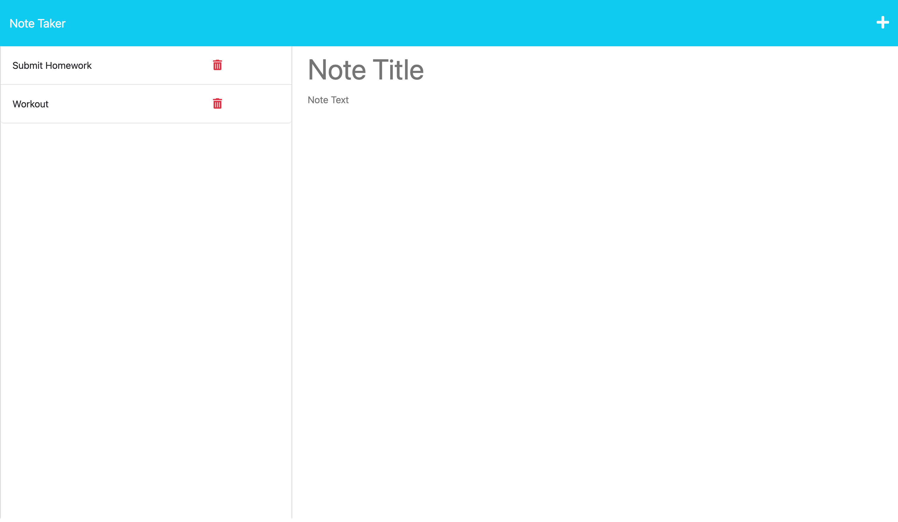

# Note Taker

## Table of Contents

- [Description](#description)
- [Installation](#installation)
- [Usage](#usage)
- [Contributions](#contributions)
- [License](#license)

## Description

- An app designed for small business owners to be able to write and save notes so they can can organize their thoughts and keep track of tasks that need to be completed.

## Installation

- Latest versions of NODE JS, NPM, Express. 

## Usage

This applciation was deployed with Heroku. The link to the application is provided below.

https://powerful-cove-31608-355b68f80981.herokuapp.com/

## Contributions

## Tests

## Questions

If you would like to reach me email me at darvinmarte13@gmail.com and check out my github github.com/darvinmarte.

## License

 This application was licensed under MIT license.
